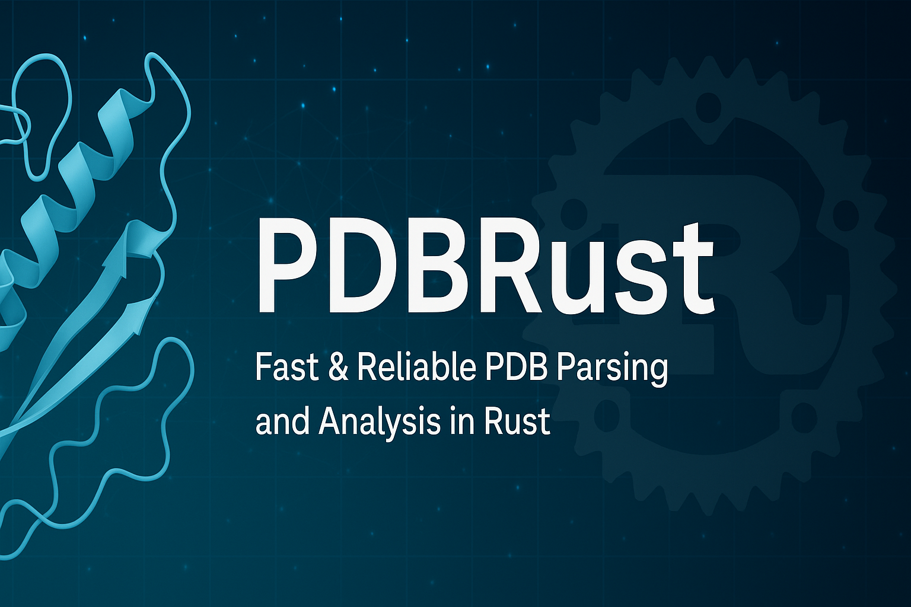

[](https://github.com/hfooladi/pdbrust/actions/workflows/rust.yml)
[](https://codecov.io/gh/hfooladi/pdbrust)
[](https://opensource.org/licenses/MIT)
[](https://crates.io/crates/pdbrust)
[](https://docs.rs/pdbrust)

<p align="center">
  
</p>

# PDBRust

A comprehensive Rust library for parsing and analyzing PDB (Protein Data Bank) files. This library provides a robust and efficient way to work with protein structure data in PDB format.

## Features

- **Complete Record Support**
  - ATOM/HETATM records with full coordinate and metadata support
  - MODEL/ENDMDL for multi-model structures
  - SEQRES records for sequence information
  - CONECT records for connectivity data
  - SSBOND records for disulfide bonds
  - REMARK records with categorization
  - HEADER and TITLE metadata

- **Robust Error Handling**
  - Custom error types for different parsing scenarios
  - Detailed error messages for debugging
  - Safe handling of malformed PDB files

- **Utility Functions**
  - Chain identification and analysis
  - Residue sequence extraction
  - Connectivity analysis
  - Model-based structure organization
  - Disulfide bond analysis

## Installation

Add this to your `Cargo.toml`:

```toml
[dependencies]
pdbrust = "0.1.0"
```

## Usage

### Basic Structure Loading

```rust
use pdbrust::PdbStructure;

fn main() -> Result<(), Box<dyn std::error::Error>> {
    // Load a PDB file
    let structure = PdbStructure::from_file("protein.pdb")?;
    
    // Access basic information
    if let Some(header) = &structure.header {
        println!("Structure header: {}", header);
    }
    
    println!("Number of atoms: {}", structure.atoms.len());
    println!("Number of models: {}", structure.models.len());
    
    Ok(())
}
```

### Chain and Residue Analysis

```rust
use pdbrust::PdbStructure;

fn analyze_chains(structure: &PdbStructure) {
    // Get all chain IDs
    let chain_ids = structure.get_chain_ids();
    
    for chain_id in chain_ids {
        // Get residues in this chain
        let residues = structure.get_residues_for_chain(&chain_id);
        println!("Chain {} has {} residues", chain_id, residues.len());
        
        // Get sequence if available
        let sequence = structure.get_sequence(&chain_id);
        if !sequence.is_empty() {
            println!("Sequence: {}", sequence.join("-"));
        }
    }
}
```

### Connectivity Analysis

```rust
use pdbrust::PdbStructure;

fn analyze_connectivity(structure: &PdbStructure) {
    // Analyze disulfide bonds
    for bond in &structure.ssbonds {
        println!("Disulfide bond between:");
        println!("  Residue 1: {} {} {}", bond.residue1_name, bond.chain1_id, bond.residue1_seq);
        println!("  Residue 2: {} {} {}", bond.residue2_name, bond.chain2_id, bond.residue2_seq);
        println!("  Distance: {:.2} Å", bond.length);
    }
}
```

### Parallel Processing

```rust
use pdbrust::PdbStructure;
use pdbrust::features::parallel;

#[cfg(feature = "parallel")]
fn process_structures_parallel(structures: Vec<PdbStructure>) {
    use rayon::prelude::*;
    
    let results: Vec<_> = structures.par_iter()
        .map(|structure| {
            // Process each structure in parallel
            structure.atoms.len()
        })
        .collect();
    
    println!("Total atoms across all structures: {}", results.iter().sum::<usize>());
}
```

### Geometric Analysis

```rust
use pdbrust::PdbStructure;
use pdbrust::features::geometry;

#[cfg(feature = "geometry")]
fn analyze_structure_geometry(structure: &PdbStructure) {
    use nalgebra::Vector3;
    
    // Calculate center of mass
    let com = structure.calculate_center_of_mass();
    println!("Center of mass: {:?}", com);
    
    // Calculate radius of gyration
    let rg = structure.calculate_radius_of_gyration();
    println!("Radius of gyration: {:.2} Å", rg);
}
```

## Features

PDBRust supports several optional features that can be enabled in your `Cargo.toml`:

```toml
[dependencies]
pdbrust = { version = "0.1.0", features = ["parallel", "geometry"] }
```

- `parallel`: Enables parallel processing capabilities using Rayon
- `geometry`: Adds geometric analysis functions using nalgebra

## Contributing

We welcome contributions! Please feel free to submit a Pull Request. For major changes, please open an issue first to discuss what you would like to change.

1. Fork the repository
2. Create your feature branch (`git checkout -b feature/amazing-feature`)
3. Commit your changes (`git commit -m 'Add some amazing feature'`)
4. Push to the branch (`git push origin feature/amazing-feature`)
5. Open a Pull Request

### Development Setup

1. Clone the repository:
   ```bash
   git clone https://github.com/hfooladi/pdbrust.git
   cd pdbrust
   ```

2. Install dependencies:
   ```bash
   cargo build
   ```

3. Run tests:
   ```bash
   cargo test
   ```

4. Run benchmarks:
   ```bash
   cargo bench
   ```

### Code Style

- Follow the Rust standard style guide
- Run `cargo fmt` before committing
- Run `cargo clippy` to check for linting issues
- Ensure all tests pass with `cargo test`
- Add tests for new functionality
- Update documentation as needed

## License

This project is licensed under the MIT License - see the [LICENSE](LICENSE) file for details.

## Acknowledgments

- The Protein Data Bank (PDB) for providing the standard format
- The Rust community for excellent tools and libraries
- All contributors to this project 